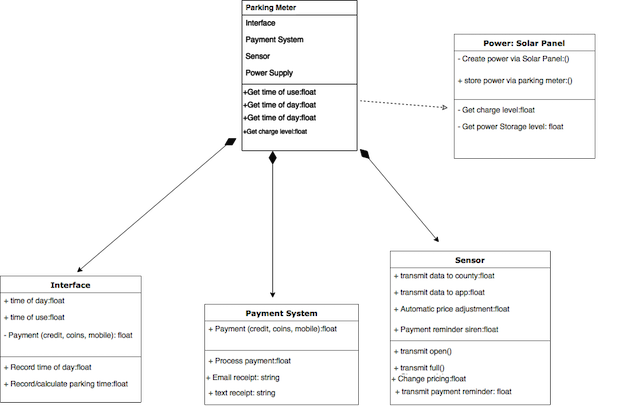
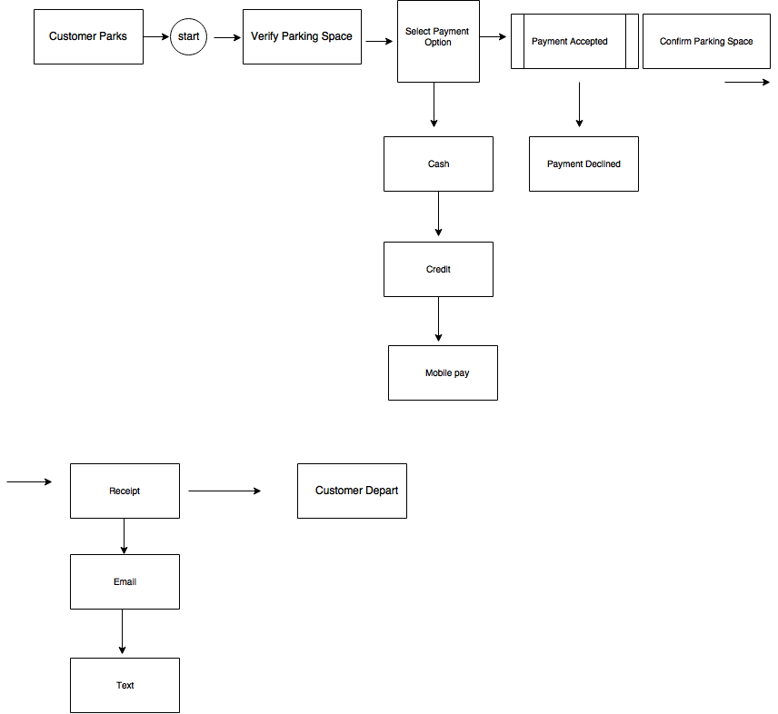

# Assignment1 - Practice Designing Models (Template)

> * Participant name: TJ Naylor
> * Project Title: Smart Meter

## General Introduction

Properly defined a **Smart City** is a city that uses different types of electronic data collection sensors to supply information to manage assets and resources efficiently (Hamblen, 2015). For this assignment, a **Smart City** incorporates the following requirements: 

1.	Improve/Enhance communities with electronic and digital technologies
2.	Use Information and Communication Technology (ICT) to transform life and working 	 environments
3.	Leverages ICT technology for government systems (Deakin, 2013, p.15).

Many large cities such as Orlando experience heavy traffic during peak working hours and during major events. As a result, parking is often very difficult to find and often requires significant time to find an available parking space. Additionally, sometimes you find a parking and subsequently find out the meter is broken. If a city is equipped with **Smart Meters**, you can find available parking when you arrive in the area. Moreover, you can pay the meter with your smartphone without the hassle of using coins.

## Requirements (Experimental Design)

My hypothesis is that cities can increase efficiency and reduce its carbon footprint by incorporating **Smart Meters**. They alleviate the hassle of drivers searching around the city looking for parking because the smart meter sensor communicates with an application and signals when it is vacant or occupied. It also identifies when a meter requires maintenance. It reduces the government work force because it takes less coins and thus requires fewer people to check the meter to collect the coins. If a city wants to be ambitious it could include charging stations for vehicles. The “smart meter” requirements are included below.

1.	Equipped with sensor to signal occupancy of the meter through an app and provide analytics to the city	    	 	 government.
2.	Provide at least three different payment options (coins, credit, mobile pay).
3.	Use digital interface to communicate applicable data.
4.	Power itself through solar.
5.	Metal frame to endure wear and tear.

## Smart City (My Problem) Model

# Object Diagram
 [**Object Diagram**](images/Objectdiagram1.png)
# Class Diagram
 
# Behavior Diagram
 

## Smart City (My Problem) Simulation

(remove: for part 3 add two to three sentences here and link the [**(your own name)**](model/README.md) file in the analysis folder - which describe how you would simulate this - type of simulation, rough details -inputs, outputs - how it will help you analyze your experimental hypothesis, or nullify your null hypothesis.)

## Smart City (My Problem) Model
[**Code template**](code/README.md) - Starting coding framework for the (insert your exact problem here.)

## **P**ortable **O**rganic **T**rouble-free **S**elf-watering System (**POTS**) Model
Here [**we provide an overview**](code/POTS_system/README.md) of the **P**ortable **O**rganic **T**rouble-free **S**elf-watering System (**POTS**) Model and provide a source code template.
